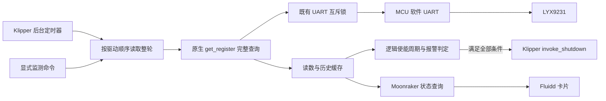
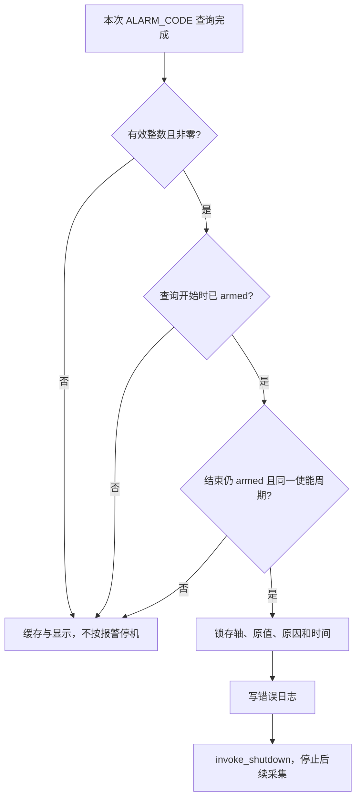

# 实现与状态模型

本项目由 Klipper 主机端采集模块和 Fluidd 页面组件组成。后台独立采集并缓存，浏览器读取缓存；关闭网页不会停止后台。MCU 的 UART 实现及正式 LYX 驱动属于前置依赖，本监测模块不新增引脚、不写驱动寄存器、不主动使能或移动电机。

## 数据路径



`klippy:ready` 时通过 `lookup_objects('lyx9231')` 发现已有对象，例如 `[lyx9231 stepper_x]`。监测模块只引用其 `mcu_lyx`，不会重新构造驱动或重复占用 UART 引脚。前端仅为这些 LYX 对象建立卡片，不查询 TMC 对象状态；后台的采集、历史和报警保护也仅适用于 LYX9231。原有 TMC 运动、固件支持和 Klipper 自带保护不受本组件影响。

源码：[对象发现](../backend/driver_monitor.py)、[原生传输](../vendor/lyx/lyx_uart.py)。

## 一次查询与一轮采集

动态顺序固定为：

```text
ALARM_CODE 完成 → 等 read_gap → MOTOR_SPEED 完成
→ 等 read_gap → ERROR_ANGLE 完成 → 下一个驱动
→ 全部驱动处理结束 → 等 cycle_interval → 下一轮
```

驱动按名称排序。保护开启时，启动首轮先处理该驱动的动态三项，再读取 `CHIP_MODEL` 和 `RUN_CURRENT`；保护关闭时静态两项在前。静态项每个 ready 会话各实际尝试一次，失败也不周期重试；尚未轮到的静态项保留待处理。

每项调用一次原生 `mcu_lyx.get_register()`，等待其返回或抛错后才处理下一项。原生实现内部最多进行 1000 次底层读取，失败帧之间等待 1 ms。监测模块不额外重试完整事务，也不能中途撤销已经开始的原生查询。

- `read_gap` 默认 0.2 秒，从上次完整查询结束算起，全局覆盖监测模块的自动、手动、启动及多驱动入口。它不约束原生内部重试帧或其他原生命令。
- `cycle_interval` 默认 1 秒，从全部驱动本轮处理完毕算起；不等于每秒完成一轮。
- 延迟的定时器不会补发遗漏轮次；忙碌时跳过，不累积任务。
- 某驱动普通通信错误结束其当前批次，其他驱动仍可继续；shutdown 则停止全部后续采集。

## 互斥与协作式等待

模块级 `active` 防止手动和后台重叠。原生查询负责持有既有 UART 锁；监测器先用 `mutex.test()` 检查，再不经主动让出直接调用原生接口，不能在外层重复取得同一把锁。

项间等待使用 `reactor.pause()`，保持模块自身占用，但不占 UART 锁。等待结束重新检查 ready、自动暂停状态及总线忙碌。原生 UART 锁按 MCU 共享，同 MCU 上不同 LYX 引脚也会串行；不能把它描述为每个独立引脚完全并行。

## 读数、历史与统计

`get_status(eventtime)` 只复制缓存及计算状态，不提交 UART 请求。`schema_version=1`，主要字段如下：

| 字段 | 含义 |
| --- | --- |
| `drivers` | 已发现 LYX 驱动和五个可读寄存器名称 |
| `readings[stepper][REGISTER]` | 该寄存器最近一次完整查询结果 |
| `last_result` | 所有驱动最近一次查询结果 |
| `history[stepper]` | 速度与角度误差的采样数组 |
| `stats[stepper]` | `attempts / ok / invalid / error` 完整事务计数 |
| `stats_unit` | 固定为 `logical_transactions`，不能当 UART 帧计数 |
| `session_id` | 每次 ready 生成新值，防止跨会话拼接曲线 |
| `active / cycle_active / cycle_status` | 采集执行状态 |
| `auto_enabled / next_cycle_in` | 自动采集开关和下一轮剩余等待 |
| `shutdown_on_alarm / protection / alarm_shutdown` | 报警保护配置、每轴状态和锁存结果 |

每次结果含 `seq / stepper / register / value / outcome / started / ended / duration`；错误可另含简短 `error_type / error_message`。有效值是未经物理单位换算的无符号 16 位整数。`invalid/error` 的 `value` 为 `null`，覆盖该寄存器旧结果；不能将旧值标成最新成功。

`started/ended` 是主机单调时钟秒，不能直接按 Unix 日期解释；错误锁存中的 `unix` 才是墙钟时间。历史保留最近 600 秒、每系列最多 600 点，失败点也保留以绘制断线。ready 清空历史与读数；`seq` 和统计不承诺在每次 ready 事件归零，应结合 `session_id` 使用。

旧兼容字段 `min_interval / next_allowed_at / cooldown_remaining` 固定为零，不表示新增冷却。页面显示近五分钟曲线，读取失败不补零。

## 使能后报警停机

此逻辑已在后台实现，不依赖网页打开。`shutdown_on_alarm` 默认 `false`；在 CFG 中显式设置 `auto_start:true` 和 `shutdown_on_alarm:true` 才启用。开启后仍持续读取未使能轴的报警用于显示和日志，**只在当前使能周期内新发起并成功完成的有效非零报警读取满足全部条件时停机**；不会把使能之前的报警缓存直接用于停机。



`stepper_enable` 状态回调只更新时间和周期编号，不发送 UART。armed 要求 Klipper 当前逻辑使能，且使能计划 `print_time` 已由该轴 MCU 的 `estimated_print_time()` 达到。查询必须在当前周期开始后发起，开始和结束的周期编号一致；使能前在途请求、旧缓存、跨失能／再使能结果不会触发。

若首次 ready 时轴已使能，使用 `toolhead.get_last_move_time()` 作为此前队列的保守生效门槛，而不是伪造原始使能时间。该 API 不可用时初始化失败，不能静默永久不保护。

这是 Klipper 每轴逻辑使能保护，不是物理 EN 电平反馈。逻辑失能回调即撤防，不承诺覆盖物理禁能前的全部时间；共享或没有独立 EN 的硬件状态也不能从单轴布尔状态推出。查询延迟及最多 1000 次内部重试使其不具备硬性一秒停机时限。

报警代码与代码中的中文解释如下；它们是独立报警数值，不按位叠加解码。

| `ALARM_CODE` | 中文原因 | 满足使能保护条件时 |
| --- | --- | --- |
| 0 | 无报警 | 不停机 |
| 1 | 过流 | 停机 |
| 2 | 电机未连接 | 停机 |
| 3 | 线圈异常 | 停机 |
| 4 | 超差 | 停机 |
| 5 | 堵转 | 停机 |
| 其他有效非零值 | 未知报警码，保留原值 | 停机 |

CRC／协议错误、无效回复和重试耗尽属于通信失败，不当报警码，也不触发本项报警停机。停机调用位于读取异常捕获之外，避免被吞成通信失败。每个轴分别维护使能周期，任意 LYX 轴满足条件均调用整台 Klipper 的 `invoke_shutdown()`，不是只停该电机。

启用保护后禁止 `AUTO ENABLE=0`，关闭网页不影响保护。shutdown/disconnect 保留锁存，新 ready 只清主机锁存。据既有使用者说明，驱动报警需要断电重新上电才清除；本项目未做断电清码试验，也不会自动清码或恢复运动。

## 日志

监测模块通过 Klipper 的 Python 日志记录器记录报警值变化、通信首次失败和恢复，带轴、寄存器、Unix 和单调时钟时间；同状态不重复记录。日志进入该 Klipper 进程配置的日志文件，通常是 `klippy.log`。真正触发停机时以错误级别写出轴名、中文原因、十进制／十六进制原值和两个时间字段，同时将同一说明传给 Klipper 停机接口，并保存在 `alarm_shutdown` 缓存供网页展示。去重只覆盖新增事件，依赖驱动原有的逐帧日志仍可能持续输出。

消息格式示意（占位符不是实机故障记录）：

```text
LYX 驱动报警停机：轴 stepper_x，原因：堵转，ALARM_CODE=5 (0x0005)，unix=<时间> monotonic=<时间>。驱动报警需断电重新上电清除；Klipper 重启不代表驱动报警已清除。
```

2026-10-08 的仅 LYX 卡片改动没有修改上述后台停机判定；历史部署及离线验证与真实故障实测分开记录。真实故障停机尚未实机验收。

安装条件见主安装手册；参数和命令见[配置说明](CONFIGURATION.md)，实测边界见[验证记录](VALIDATION.md)。
