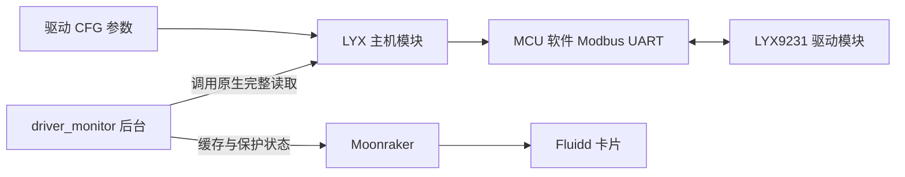

# 驱动、UART 与 MCU 依赖

## 三个独立部分



监测模块不会给普通 MCU 固件添加 `config_modbus_uart`、`modbus_uart_send`、`modbus_uart_response`。已有兼容固件和成功的原生读取是安装监测器之前的条件。

## 固定来源

基础是 [zylo117/klipper](https://github.com/zylo117/klipper) 的提交 [`231c50815e385e3ecae671577a9815f6f5b5d4a9`](https://github.com/zylo117/klipper/commit/231c50815e385e3ecae671577a9815f6f5b5d4a9)，按 GNU GPLv3 分发。`vendor/lyx` 保留源文件许可声明，提供本项目修补版，原版与修补版的 SHA256 见 [PROVENANCE.json](../vendor/lyx/PROVENANCE.json)。

修补包括电流命令实际写寄存器、细分命令参数与运动配置一致性、寄存器范围约束、初始化写入失败报告、Modbus 回复检查及写后回读验证。它不是原作者未修改版本。详细约束以三个源文件为准，不因仓库中存在寄存器地址就允许随意写入。

主机层当前固定 38400 波特率、8N1；`uart_address` 为 1–247。依赖 Klipper 的 GPIO／MCU 配置以及部分私有接口（如 `_stats_helper`、`_clocksync`），新版本需验证兼容性。

## 单线 UART 的实际含义

当前 Python 层只有一个 `uart_pin`，把同一 GPIO 用作 MCU 发送与接收。C 层虽有 RX/TX 参数，现主机接口没有分开配置这两根线，也没有 DE/RE 方向控制或外部合线电路。

这只能说明软件如何使用 MCU 引脚。驱动模块的 TX/RX 是否允许相连、NC 焊盘是否作为连通桥、逻辑电压和上拉方式，必须以具体模块作者电路／说明为依据。本仓库不把单一模块的 NC/RX/TX 接法推广为通用接线规则，也不提供未经确认的所有主板引脚表。

## r3 MCU 补丁

C8P 用户可直接使用[C8P 构建脚本](C8P_FIRMWARE.md)：分别生成普通 USB 或 USB 转 CAN 1M 固件，强制核对 LYX／TMC 所需构建选项和命令字典。两种固件只改变主机到 MCU 的连接方式，驱动侧 LYX 单线 UART 的协议不变。脚本不会安装主机模块或刷写设备。

[firmware/modbus_uart-r3.patch](../firmware/modbus_uart-r3.patch) 只针对上述固定作者版本的 `src/modbus_uart.c`。变更是把等待第一起始位的轮询从一个 bit 周期改为四分之一 bit（至少一个时钟 tick），并重新计算计数上限，保留原先约 299 bit 的首次轮询到超时跨度。协议、发送后等待 20 bit 和数据位采样没有重写，后续字节仍按固定节拍采样。

原版文件 SHA256：`895b6dcba659e4585097de958d5d90db51c4862ba1d24013334809b1a1f7526c`。
应用补丁后的文件 SHA256：`80eb1d99f7553c4f95bb9404af28e402f1c659da84ce292ec85cd045a49cb818`。

准备源码的示意步骤如下；这些步骤不是自动刷写工具：

```sh
git clone https://github.com/zylo117/klipper.git klipper-lyx-build
cd klipper-lyx-build
git checkout 231c50815e385e3ecae671577a9815f6f5b5d4a9
git switch -c build/lyx-uart-r3
# 替换为本仓库在本机的真实绝对路径。
git apply --check /path/to/klipper-driver-monitor/firmware/modbus_uart-r3.patch
git apply /path/to/klipper-driver-monitor/firmware/modbus_uart-r3.patch
sha256sum src/modbus_uart.c
make menuconfig
make
```

作者固定版本已在 `src/Kconfig` 中定义依赖 `HAVE_GPIO` 的 `WANT_MODBUSUART`，并在 Makefile 中按 `CONFIG_WANT_MODBUSUART` 编译该 C 文件。不需要把本仓库的补丁当成完整 Klipper 移植包。移植到其他 Klipper/FlyOS 分支时，必须分别核对原始源文件、构建选项与补丁基础，不能直接覆盖整份 Kconfig／Makefile。

`menuconfig` 的处理器、引导偏移、晶振、USB/CAN/UART 主机连接和 CAN 速率按主板版本及现有引导程序选择。MCU 与驱动之间的单线 UART，和主机到 MCU 的 USB/CAN，是两条不同链路。没有适用于全部板卡的 `.config` 或刷写命令；本仓库不分发通用二进制固件。

### 源码与主机必须配套

C8P 脚本接受明确的 `--source`，在新的目录集成 LYX 并构建。FLYOS 应优先使用本机实际运行的厂商源码，例如 `/data/klipper`，保留原有扩展接口；不会把整份 `src/Kconfig` 或 `src/Makefile` 换成作者版本。复制源码和哈希检查不代表所有厂商版本都兼容，未知集成内容会拒绝。

普通 Linux 也应优先选择本机对应源码；没有既有源码时，可按构建手册单独下载上面的固定作者提交。用作者源码构建不等于任意另一版主机都能连接，仍需核对主机与 MCU 协议。`scripts/install.py --with-lyx` 安装的是三份配套 LYX Python 模块，不会切换整套 Klipper 基础版本，也不会为未知主机版本作兼容保证。

## 已知兼容范围

历史硬件验证范围为 FLY C8 Pro / STM32H723 与这份 r3 UART 改动；`HAVE_GPIO` 仅是能进入构建的条件，不代表所有 MCU 已编译或实测。软件 UART 还受平台 GPIO 重配置、时钟量化、中断负载和振荡误差影响。其他主板、更多驱动和长期运动工况应分别验证。

MCU 源码的修改已经存在于历史实机固件；当前仓库整理没有重新刷任何机器。新增便携安装器和可配置前端目前的验证状态另列于[验证范围](VALIDATION.md)。
